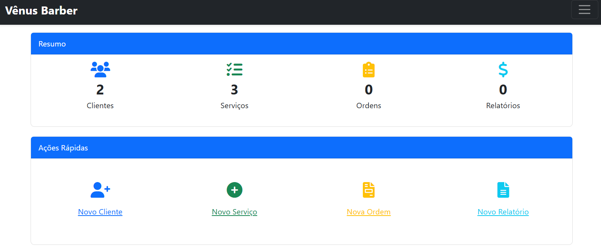
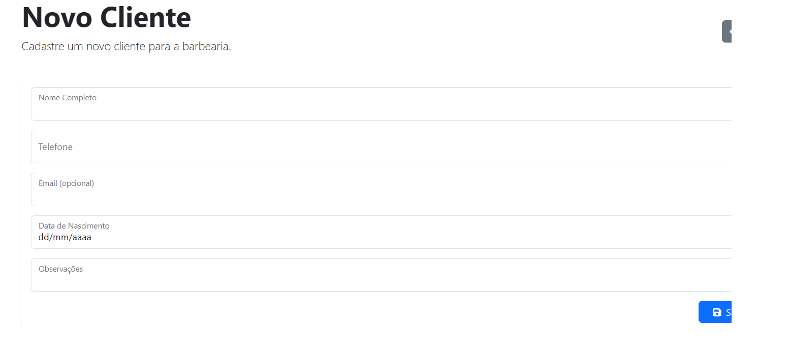
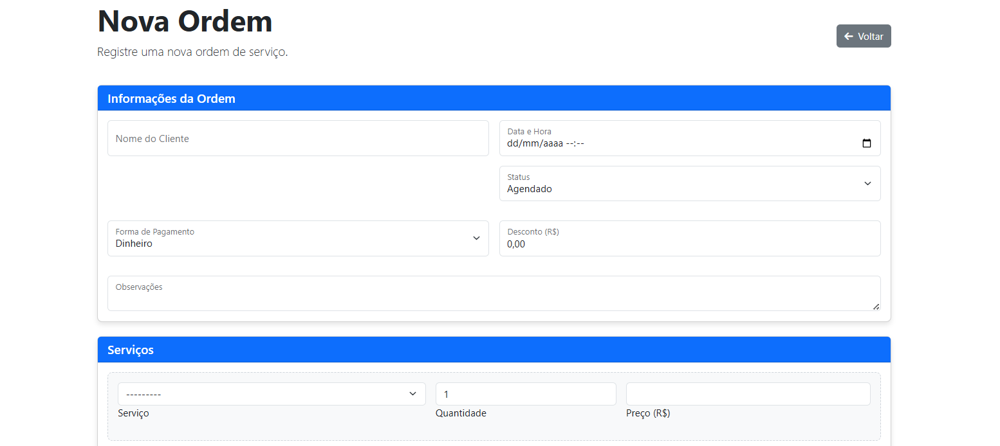
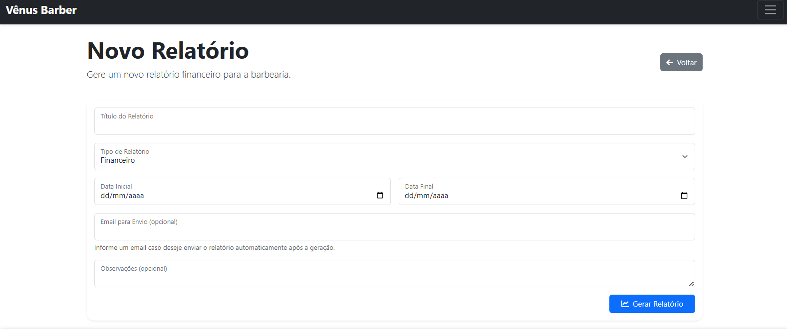

# ✂️ Vênus Barber

Sistema de gerenciamento para barbearias, desenvolvido em Django, com foco na organização de clientes, ordens de serviço e pagamentos.

> ⚠️ Este projeto é uma demonstração pública com **partes propositalmente removidas** (como algumas views e models) para **evitar uso indevido**. Caso deseje mais informações, entre em contato.

---

## 📸 Demonstrações Visuais

### 📋 Tela de Home pós Login

### 📋 Tela de Cadastro de Cliente

### 🧾 Registro de Ordem de Serviço

### 💰 Relatório de Pagamentos

---

## 🧠 Funcionalidades

- Cadastro de clientes com dados básicos.
- Registro de ordens de serviço com descrição do atendimento.
- Gerenciamento de pagamentos realizados.
- Geração de relatórios simples por período.
- Cadastro de serviços oferecidos.

---

## 🚧 Aviso de Código Removido

Para fins de proteção intelectual e segurança comercial, **trechos fundamentais do código** (como algumas views e lógicas internas dos models) foram removidos ou abstraídos neste repositório público.

> Este projeto é apenas **uma base ilustrativa**. Não representa a versão completa da aplicação comercial.

---

## ⚙️ Tecnologias utilizadas

- Python 3
- Django
- HTML5, Bootstrap
- SQLite (padrão Django)
- Git

---

## 📄 Licença

Este projeto está licenciado sob a licença **Creative Commons BY-NC-ND 4.0**  
Você pode:
- Visualizar e estudar o código.

Você **não pode**:
- Usar para fins comerciais.
- Distribuir cópias modificadas ou derivadas.

📌 Mais informações: [Licença Completa (CC BY-NC-ND 4.0)](https://creativecommons.org/licenses/by-nc-nd/4.0/deed.pt)

---

## 📬 Contato 
- LinkedIn: [Edésio Rodrigues](https://www.linkedin.com/in/devedesio-rodrigues/)

---

> Vênus Barber — Porque cada detalhe conta.
